# InterSystems Server Manager


InterSystems Server Manager is a Visual Studio Code extension for defining connections to [InterSystems](https://www.intersystems.com/) servers. These definitions can used by other VS Code extensions when they make connections. One example is the [ObjectScript extension](https://github.com/intersystems-community/vscode-objectscript) for code editing.

See the [CHANGELOG](https://marketplace.visualstudio.com/items/intersystems-community.servermanager/changelog) for changes in each release.

# New in Version 3 - November 2021

We are pleased to publish version 3 of this extension which improves the security of stored passwords by integrating with VS Code's [Authentication Provider API](https://code.visualstudio.com/api/references/vscode-api#AuthenticationProvider). This significant new release has been entered into the [November 2021 InterSystems Security Contest](https://openexchange.intersystems.com/contest/19). If you like it **please vote for it**. Voting closes at midnight EST on Sunday 5th December.

> 2021-12-01: This is currently a **pre-release** and requires VS Code 1.63. Until mid-December (estimated) you will have to use the [Insiders](https://code.visualstudio.com/insiders) build of VS Code. Insiders can be installed alongside the Stable build (currently 1.62.3) and they can run concurrently.

> Thanks to [George James Software](https://georgejames.com) for backing this development effort.

## The Authentication Provider

Since version 2 Server Manager has enabled you to store connection passwords in the native keystore of your workstation's operating system. This was a more secure alternative to you putting them as plaintext in your JSON files. However, the `getServerSpec` function in Server Manager 2's API allowed **any** installed extension to obtain these stored passwords without requiring your permission.

VS Code's Authentication Provider API, introduced in version 1.54 ([February 2021](https://code.visualstudio.com/updates/v1_54#_authentication-provider-api)) is now (version 1.63) mature enough for us to use.

Server Manager 3 does the following:

1. Implements an authentication provider called 'intersystems-server-credentials'.
2. Uses this authentication provider when accessing servers from its own [Server Tree](#the-server-tree).
3. No longer returns passwords to callers of `getServerSpec`.

> Items #2 and #3 have implications regarding backward compatibility. An interim [legacy mode](#legacy-mode) is available to help with the transition.

### Signing In

The first time you expand a server in the tree VS Code displays a modal dialog asking for your permission:

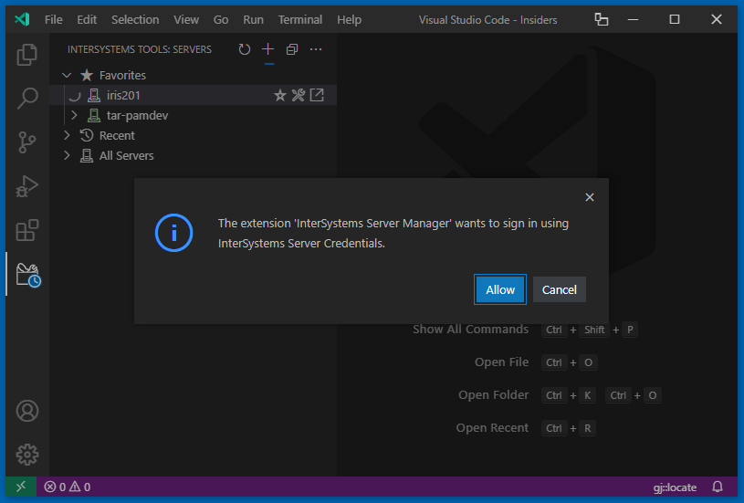

If you allow this and your server definition in `intersystems.servers` does not specify a `username` the next step is:

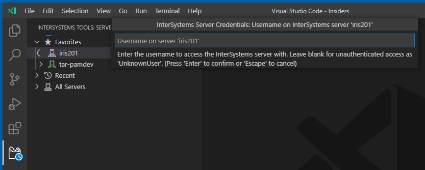

If you proceed, or if this step was skipped because your server definition includes a username, the next step is:

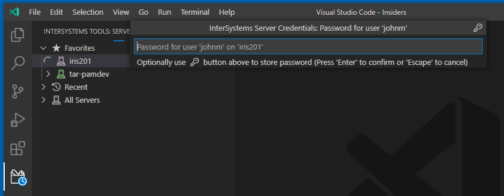

If you click the 'key' button after typing your password it will be saved securely in your workstation keychain, from where the 'InterSystems Server Credentials' authentication provider will be able to retrieve it after you restart VS Code.

If instead you press 'Enter' the password will be available only until you restart VS Code.

Either way, you are now signed in on the specified account.

### Trusting Other Extensions

When another extension first asks to use an InterSystems Server Credentials account you must either allow this or deny it. For example, with a pre-release build of the InterSystems ObjectScript extension which uses the new authentication provider you get this after you click the edit pencil button alongside a namespace in the [Server Manager tree](#the-server-tree):


### Managing Signed In Accounts

You can use the menu of VS Code's Accounts icon in the activity bar to manage your signed in accounts:

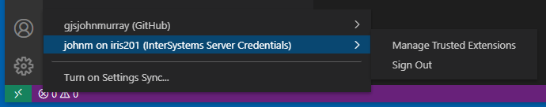

The 'Manage Trusted Extensions' option lets you remove an extension from the list of those you previously granted access to this InterSystems Server Credentials account:

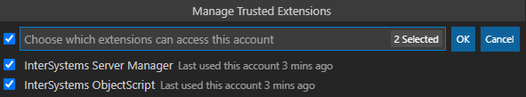

The 'Sign Out' option lets you sign out this account after confirmation:

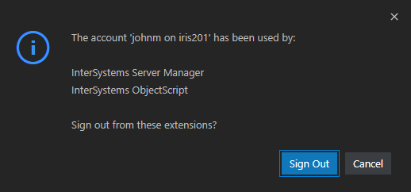

When signing out an account for which you previously saved the password will get an option to delete the password, unless you have altered the `intersystemsServerManager.credentialsProvider.deletePasswordOnSignout` setting:

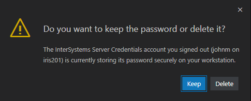

---

# New in Version 2 - April 2021

The following features were originally introduced in Server Manager version 2.

## The Server Tree

Server Manager displays connection definitions as a tree on an InterSystems Tools view:

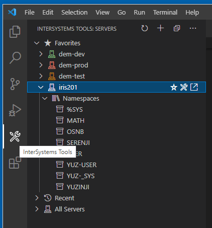

In this tree you can:

- Launch the InterSystems Management Portal, either in a VS Code tab or in your default browser.
- List namespaces.
- Add namespaces to your VS Code workspace for viewing or editing source code on the server, including web application (formerly CSP) files, with the [ObjectScript extension](https://github.com/intersystems-community/vscode-objectscript).
- Tag favorite servers.
- Set icon colors.
- Focus on recently used connections.
- Manage stored passwords.
- Add new servers, and edit existing ones.

In common with the rest of VS Code, Server Manager stores your connection settings in JSON files. VS Code settings are arranged in a hierarchy that you can learn more about [here](https://code.visualstudio.com/docs/getstarted/settings).

Server Manager can store connection passwords in the native keystore of your workstation's operating system. This is a more secure alternative to you putting them as plaintext in your JSON files.

On Windows, Server Manager can create connection entries for all connections you previously defined with the original Windows app called InterSystems Server Manager. This action is available from the '`...`' menu at the top right corner of Server Manager's tree.

## Defining a New Server

1. Click the '`+`' button on Server Manager's title bar.
2. Complete the sequence of prompts.
3. Expand `All Servers` to see your new entry in the tree.

The server definition is added to your [user-level](https://code.visualstudio.com/docs/getstarted/settings) `settings.json` file and also appears at the top of the 'Recent' folder.

Optionally use its context menu to store the password for the username you entered when defining the server. You can also set the color of the server icon.

The 'star' button that appears when you hover over the row lets you add the server to the `Favorites` list at the top of the tree.

## Viewing and Editing Source Code

1. Expand the target server, then expand its 'Namespaces' folder.
2. Hover over the target namespace to reveal its command buttons.
3. Click the 'edit pencil' icon to add an `isfs://server:namespace/` folder to your VS Code workspace, or use the 'viewing eye' icon to add an `isfs-readonly://server:namespace/` one.
4. To add a folder that gives you access to server-side web application files (for example, CSP files), hold the <kbd>Alt</kbd> / <kbd>Option</kbd> key down as you click the button for the type of access you want.

Learn more about `isfs` and `isfs-readonly` folders in the [InterSystems ObjectScript for VS Code documentation](https://intersystems-community.github.io/vscode-objectscript/serverside).

> If you are already doing client-side editing of your code (for example, managing it with Git), be sure you understand the consequences of also doing server-side editing using `isfs`. The ObjectScript extension's [README](https://marketplace.visualstudio.com/items?itemName=intersystems-community.vscode-objectscript) outlines the differences between client-side and server-side editing. If in doubt, limit yourself to `isfs-readonly` by only using the eye icon.

## The 'Current' Folder

When you have a folder or a workspace (including a multi-root one) open in VS Code, the Server Manager displays a 'Current' node at the start of its tree if your workspace references any server defined in Server Manager. The linking happens automatically if you added workspace folders from Server Manager as described above. If you are using the client-side mode of working, your `objectscript.conn` setting needs to use the `server` property.

## Launching Management Portal

When you hover over a server entry in the tree, two command buttons let you launch InterSystems Management Portal.

The first button uses VS Code's Simple Browser feature, which creates a tab alongside any documents you may have open. The second button opens Portal in your workstation's default web browser.

### Notes About Simple Browser
- There is only ever a single Simple Browser tab. Launching another server's Management Portal in it will replace the previous one.
- If the server version is InterSystems IRIS 2020.1.1 or later you will need to change a setting on the suite of web applications that implement Management Portal. This is a consequence of change [SGM031 - Support SameSite for CSP session and user cookies](https://docs.intersystems.com/iris20201/csp/docbook/relnotes/index.html#SGM031). Simple Browser will not be permitted to store Portal's session management cookies, so Portal must be willing to fall back to using the CSPCHD query parameter mechanism.
    -  Locate the five web applications whose path begins with `/csp/sys`
	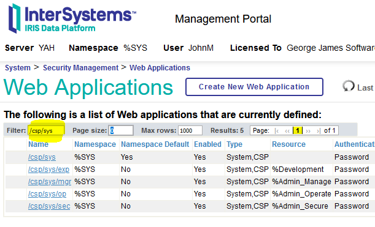

	- Alter the `Use Cookie for Session` setting on each of them so it is `Autodetect` instead of `Always`.
	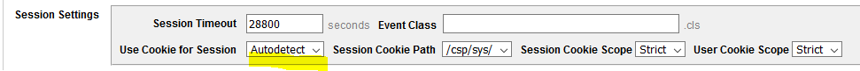
	Remember to save the change. The change is not thought to have any adverse effects on the usage of Portal from ordinary browsers, which will continue to use session cookies.
- When a 2020.1.1+ Portal has resorted to using CSPCHD (see above) a few inter-page links fail because they don't add the CSPCHD queryparam. One specific case is the breadcrumb links. Pending the arrival of an InterSystems correction (JIRA DP-404817) these links will take you to the login page. Either enter your credentials to proceed, or launch Simple Browser again from the Server Manager tree.

## Amending and Removing Servers

To manage your server definitions, including changing the username it connects with, [edit the relevant JSON file](https://code.visualstudio.com/docs/getstarted/settings).

1. From a server's context menu, or from Server Manager's top-right '`...`' menu, choose `Edit Settings`. This opens VS Code's Settings Editor and filters its contents.

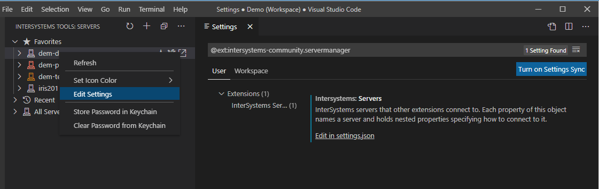

2. Click the `Edit in settings.json` link.

In this example two connections have been defined:

```json
"intersystems.servers": {
	"dev": {
		"webServer": {
			"scheme": "https",
			"host": "webhost.local",
			"port": 443,
			"pathPrefix": "/iris/dev"
		},
		"username": "alice",
		"description": "Development server serviced by central web host over HTTPS"
	},
	"my-local": {
		"webServer": {
			"scheme": "http",
			"host": "127.0.0.1",
			"port": 52773
		},
		"description": "My local IRIS instance"
	},
	"/default": "my-local",
	"/hideEmbeddedEntries": true
}
```

The JSON editor offers the usual [IntelliSense](https://code.visualstudio.com/docs/editor/intellisense) as you work in this structure.

Notice how you can add a `description` property to each connection. This will be shown in the hover in Server Manager's tree, and alongside the entry if a server quickpick is used.

Servers are displayed in the quickpick in the order they are defined in the JSON file. The exception is that if a server name is set as the value of the `/default` property (see example above) it will be shown first in the list.

A set of embedded servers with names beginning `default~` will appear at the end of the lists unless you add the property `"/hideEmbeddedEntries": true` to your `intersystems.server` object to hide them (see above).

## Removing a Stored Password

Use the server's context menu. Alternatively, run `InterSystems Server Manager: Clear Password from Keychain` from Command Palette.

---

## Technical Notes

### Legacy Mode

Server Manager 3 makes changes which may degrade the user experience relative to version 2. To revert, make this user-level setting:
```json
"intersystemsServerManager.authentication.provider": "none"
```
Please only use this as a short term measure until extensions that use the Server Manager `getServerSpec` API get updated to use the 'intersystems-server-credentials' authentication provider. The setting may be removed in a future release.

### Colors, Favorites and Recents

These features use VS Code's extension-private global state storage. Data is not present in your `settings.json` file.

### The 'All Servers' Folder

The `All Servers` tree respects the optional `/default` and `/hideEmbeddedEntries` settings in the `intersystems.servers` JSON.

If a server has been named in `/default` it is promoted to the top of the list, which is otherwise presented in alphabetical order.

Embedded entries (built-in default ones) are demoted to the end of the list, or omitted completely if `/hideEmbeddedEntries` is true.

---

## Information for VS Code Extension Developers - How To Leverage Server Manager

An extension XYZ needing to connect to InterSystems servers can define Server Manager as a dependency in its `package.json` like this:

```json
  "extensionDependencies": [
    "intersystems-community.servermanager"
  ],
```

Alternatively the `activate` method of XYZ can detect whether the extension is already available, then offer to install it if necessary:

```ts
  const extId = "intersystems-community.servermanager";
  let extension = vscode.extensions.getExtension(extId);
  if (!extension) {
	// Optionally ask user for permission
	// ...

	await vscode.commands.executeCommand("workbench.extensions.installExtension", extId);
	extension = vscode.extensions.getExtension(extId);
  }
  if (!extension.isActive) {
    await extension.activate();
  }
```

XYZ can then use the extension's API to obtain the properties of a named server definition, including the password from the keychain if present:

```ts
  const serverManagerApi = extension.exports;
  if (serverManagerApi && serverManagerApi.getServerSpec) { // defensive coding
	const serverSpec = await serverManagerApi.getServerSpec(serverName);
  }
```

If the `username` property is absent it will be prompted for. If no `password` is stored in the keychain or in the JSON definition the user will be asked to provide this the first time in any session that `getServerSpec` is called for a given server.

To offer the user a quickpick of servers:

```ts
  const serverName = await serverManagerApi.pickServer();
```

To obtain an array of server names:

```ts
  const allServerNames = await serverManagerApi.getServerNames();
```
For details of the API, including result types and available parameters, review the source code of the extension's `activate` method [here](https://github.com/intersystems-community/intersystems-servermanager/blob/master/src/extension.ts).

---
<div>Activity Bar icon made by <a href="https://www.freepik.com" title="Freepik">Freepik</a> from <a href="https://www.flaticon.com/" title="Flaticon">www.flaticon.com</a></div>
